# CSMA/CA

## Usage

```bash
$ pip install -r requirements.txt
$ python3 main.py
```

## Configuration

config.py

```python
default_settings = {
    "star_topology": True,
    "with_rts": True,
    "propagation_speed": SPEED_OF_LIGHT / 3,
    "area_size": 80,
    "station_count": 10,
    "data_rate": 11 * MEGA,
    "frame_rate": 300,
    "detect_range": 40,
    "frame_size": 8 * 1500,
    "backoff_min": 4,
    "backoff_max": 1024,
    "interval": 0.05,
    "slot_time": 20,
    "step": 10,
    "max_time": ONE_SECOND,
    "log": True,
    "log_screen": True,
    "sifs": 10,
}
```

## Example

10 Stations with star topology

```


                                          6


                                                          9


                                                      1
                                              █D    + + 4 + +   + + + + + +
                                              * + + - - - - -   - - - - - - + + +
                                        + + + - * - - - - - -   - - - - - - - - - + + +
                                      +   - - - * - - - - - - - - - - - - - - - - - -   +
                                  + + - - - - - * - - - - - - - - - - - - - - - - - - - - + +
                                + + - - - - - - - 0*- - - - - - - - - - - - - - - - - - - - + +
                              2   - -   - - - - - * - - - - - - - - - - - - - - - - - -   - -   +
                            + - - - - - - - - - - *   - - - -   - - - - -   - - - - - - - - - 8 - +
                          +   - - -   - - - -   - - * - - - -   - - - - - - - -   - - - -   - - -
                        + - - - - - - -   - - - - - * - - - -   - - - - - - - - - - -   - - - - - -
                        + - - -   - - - - -   -   - - * - - - - - - - - - 7 -   -   - - - - -   - -
                      + -   - - - - - - - - - - - - - * - - - - - - - - - - - - - - - - - - - - - -
                    +   - - - - -   - -   - - - - - - * - - - - - - - - - - - - - - -   - -   - - -
                    + - - - -   - - - - - - - - - - - - * - - - - - - - - - - - - - - - - - - -   -
                  +   - - - - - - - - - - -   - - - -   * - -   - - - -   - - - -   - - - - - - - -
                  + - - - - - - - - - -   - - -   - - - * - -   - - - - - - -   - - -   - - - - - -
                  + - - - - - - - - - - - - - - - - - - - * -   - - - - - - - - - - - -   - - - - -
                +   - -   - - - - - - - - - - - - -   - - * - - - - - - -   - - - -   - - - - - - -
                + - - - - - - -   - -   - - - - - - - -   * - - - - -   - - - - - - - -   - -   - -
                + - - - - - - - - - - - -   - - - - - - - - * - - - - - - - - - - -   - - - - - - -
                + - - - - - - - - - - - - - - - - -   - - - * - - - - - -   - - - - - - - - - - - -
                + - - - - - - - - - - - - - - - - - - - -   *   - -   - - - - - - - - - - - - - - -
                + - - - - - - - - - - - - - - - - - - - - -   * - - - - - - - - - - - - - - - - - -
                + - - - - - - -   - - - - - -   - - - - - - - * - - 3 - - - - -   - - - - - -   - -
                +   - - - - - - - - - - - - - - - - - - - - - - 5*  - - - - - -   - - - - - -   - -
                + - - - - - - - - - - - - - - - - - - - - - - - - - - - - - - - - - - - - - - - - -
                + - - - - - - - - - - - - - - - - - - - - - -   - - - - - - - - - - - - - - - - - -
                + - - - - - - - - - - - - - - - -   - - -   - - - -   - - -   - - - - - - - - - - -
                + - - - - - - - - - - - - -   - - - -   - - -   - - - -   - - - -   - - - - - - - -
                + - - - - - - -   - - - - - - - - - - - - - -   - - - - - - - - - - - - - - -   - -

[time]              0.89ms

[wasted]            0.00ms
[throughput]        0.00 kbps
[throughput rate]   ░░░░░░░░░░░░░░░░░░░░ 0.00% 0.00/11000.00

[collision rate]    ░░░░░░░░░░░░░░░░░░░░ 0.00% 0/2
[frames on air]      1

[node details]
  ID |   s |   r |   c |     send |     recv |                        sending |                      receiving |     detected |   bo max |  backoff |     difs |     sifs |  timeout |      nav | allocate |
[ 0] |   1 |   1 |   0 | ░░░░░░░░ | █D░░░░░░ |                                | ██████░░░░░░░░░░░░░░ 33.00%    |  DATA 5 -> 0 |        3 |        0 |        0 |        0 |     1840 |          |          |
[ 1] |   0 |   1 |   0 | ░░░░░░░░ | ░░░░░░░░ |                                |                                |              |        3 |        0 |        0 |        0 |          |     1880 |          |
[ 2] |   0 |   2 |   0 | ░░░░░░░░ | ░░░░░░░░ |                                |                                |  DATA 5 -> 0 |        3 |        0 |        0 |        0 |          |     1880 |          |
[ 3] |   0 |   2 |   0 | ░░░░░░░░ | ░░░░░░░░ |                                |                                |  DATA 5 -> 0 |        3 |        0 |        0 |        0 |          |     1880 |          |
[ 4] |   0 |   2 |   0 | ░░░░░░░░ | ░░░░░░░░ |                                |                                |  DATA 5 -> 0 |        3 |        0 |        0 |        0 |          |     1880 |          |
[ 5] |   1 |   1 |   0 | █D░░░░░░ | ░░░░░░░░ | ██████░░░░░░░░░░░░░░ 34.83%    |                                |              |        3 |        0 |        0 |        0 |     1900 |          |     1880 |
[ 6] |   0 |   1 |   0 | ░░░░░░░░ | ░░░░░░░░ |                                |                                |              |        3 |        0 |        0 |        0 |          |     1880 |          |
[ 7] |   0 |   2 |   0 | ░░░░░░░░ | ░░░░░░░░ |                                |                                |  DATA 5 -> 0 |        3 |        0 |        0 |        0 |          |     1880 |          |
[ 8] |   0 |   2 |   0 | ░░░░░░░░ | ░░░░░░░░ |                                |                                |  DATA 5 -> 0 |        3 |        0 |        0 |        0 |          |     1880 |          |
[ 9] |   0 |   1 |   0 | ░░░░░░░░ | ░░░░░░░░ |                                |                                |              |        3 |        0 |        0 |        0 |          |     1880 |          |
```

## Experiments

### Minimum Backoff

bps
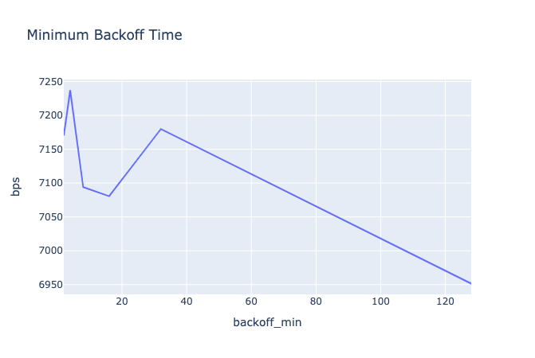

wasted
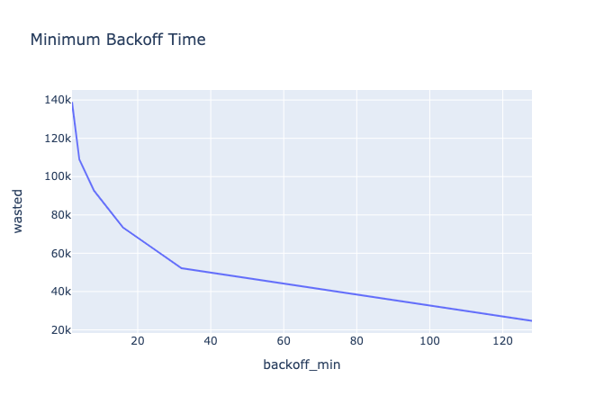

### Frame Rate

bps
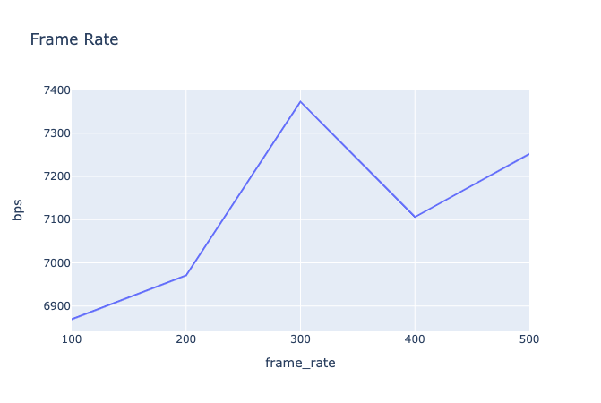

wasted
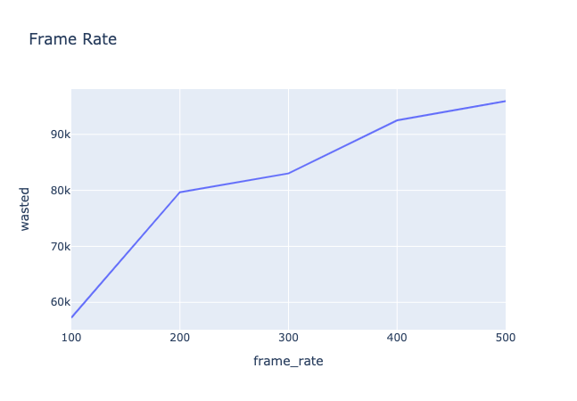

### Station Count

bps
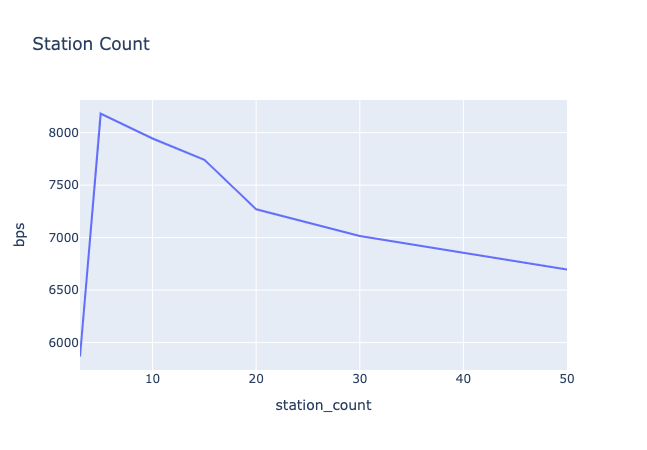

wasted
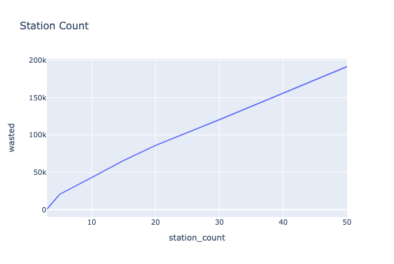

### Station Count & Minimum Backoff

bps
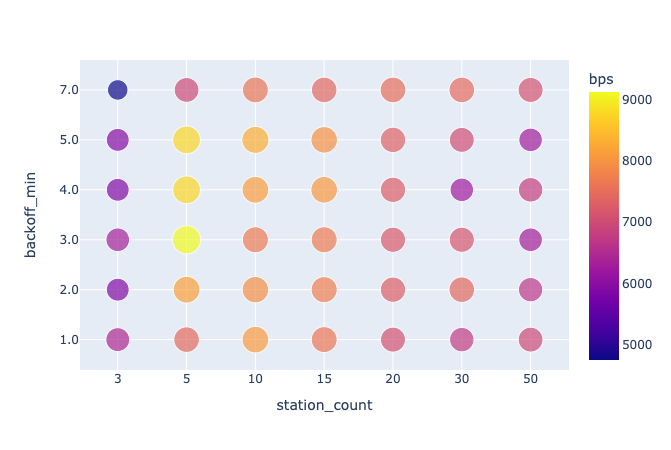
wasted
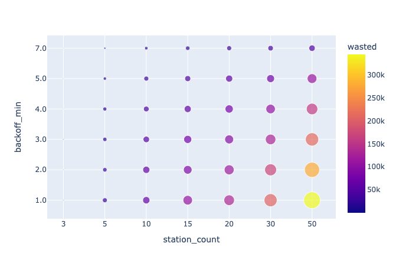

### Station Count & Frame Rate

bps
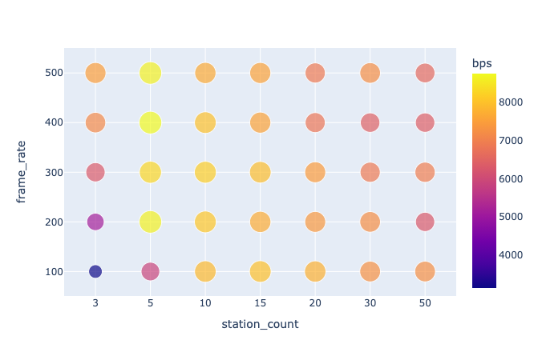
wasted
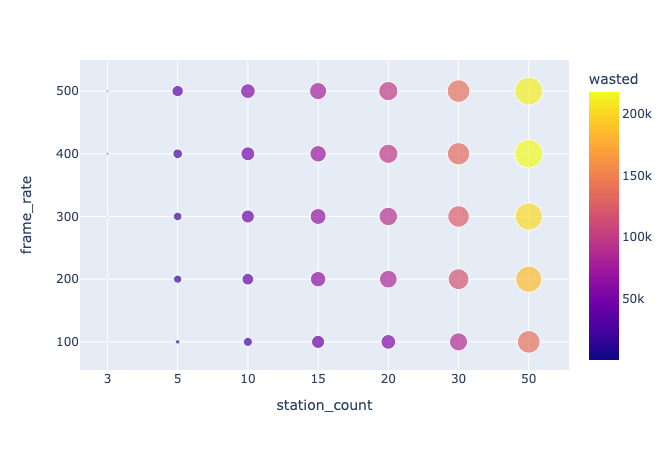

### Frame Rate & Minimum Backoff

bps
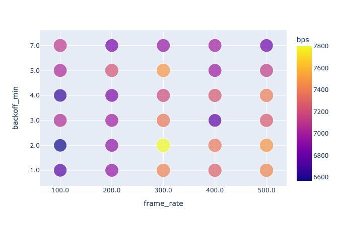
wasted
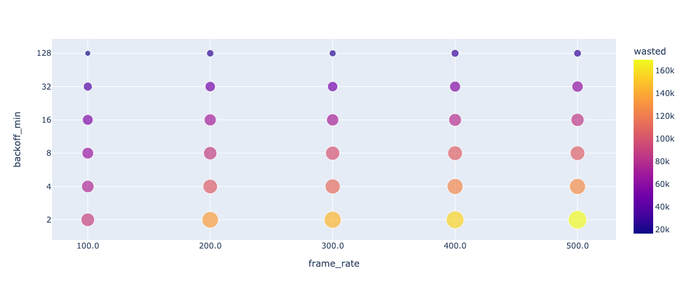
