# CSMA/CA

# Usage

## Installation

```bash
$ pip install -r requirements.txt
```

## Execution

```bash
$ python3 main.py  # for mono simulation with graphical log
```

```bash
$ python3 main.py --simulation # for simulations with various settings
```

```bash
$ python3 main.py --simulation --multiprocess # for faster simulations with multiprocessing
```

```bash
$ python3 main.py --simulation --pass-done # pass simulations with settings which already have done
```

## Configuration

config.py

```python
default_settings = {
    "star_topology": True,
    "with_rts": True,
    "propagation_speed": SPEED_OF_LIGHT / 3,
    "area_size": 80,
    "station_count": 10,
    "data_rate": 11 * MEGA,
    "frame_rate": 300,
    "detect_range": 40,
    "frame_size": 8 * 1500,
    "backoff_min": 4,
    "backoff_max": 1024,
    "interval": 0.05,
    "slot_time": 20,
    "step": 10,
    "max_time": ONE_SECOND,
    "log": True,
    "log_screen": True,
    "sifs": 10,
}
```

# Example

8 Stations with star topology

Station 7 wants to send RTS, waiting for DIFS timer.

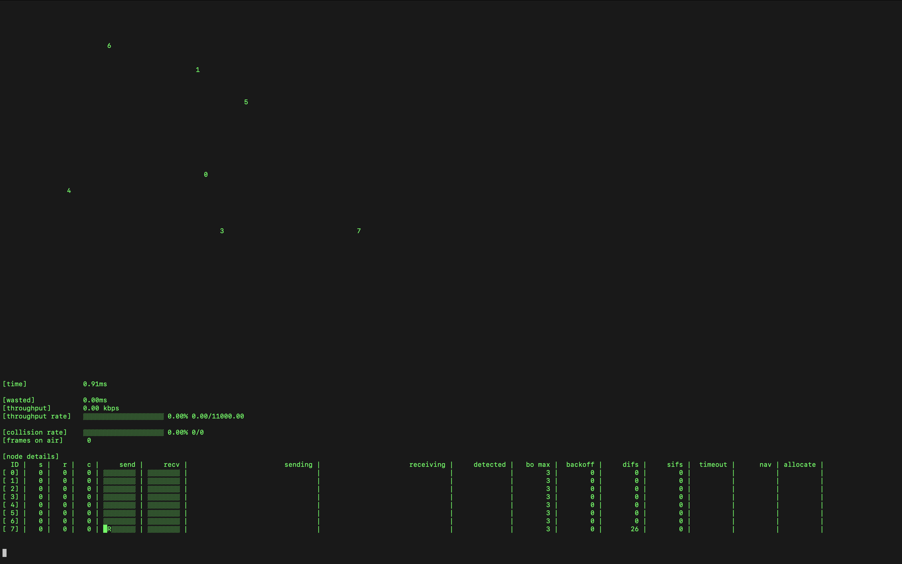

Station 7 is sending RTS to Station 0

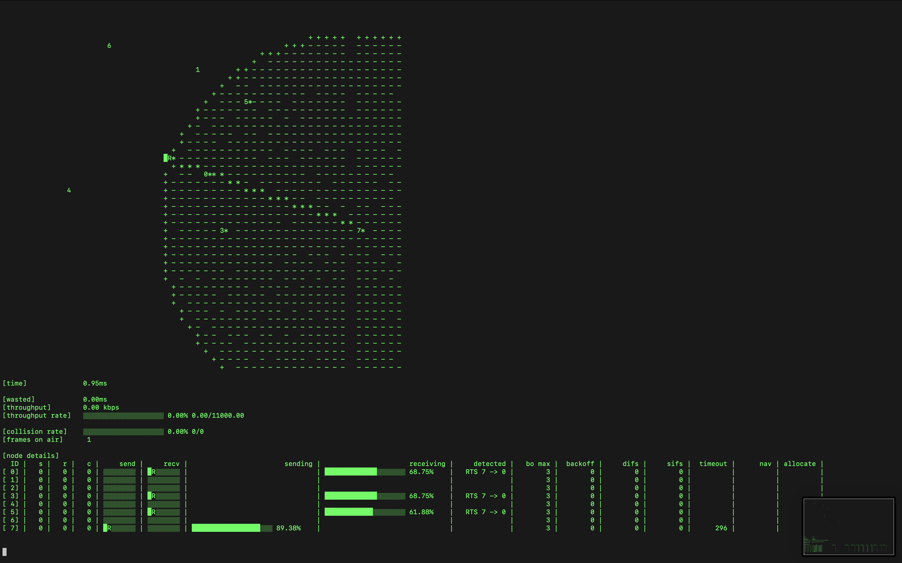

Station 0 is sending CTS to Station 7,
Other stations which have received RTS have set their NAV timer.

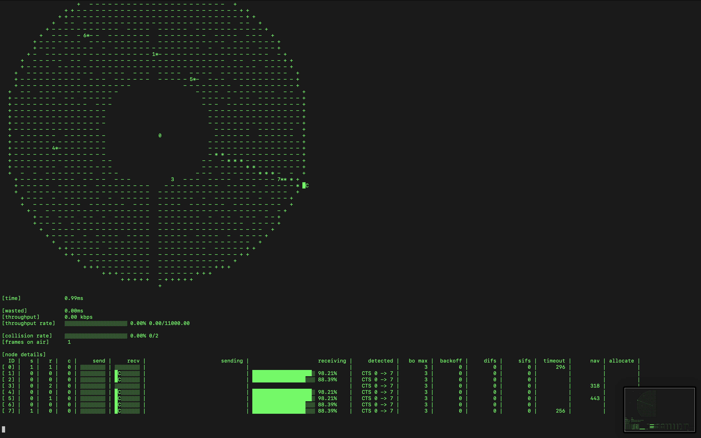

Station 7 is sending DATA to Station 0,
Other stations which have received CTS have set their NAV timer.

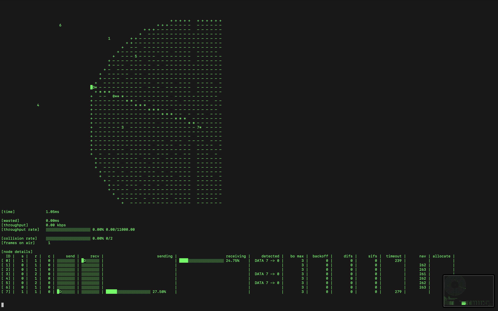

Station 0 is sending ACK to Station 7,
station 7 is counting down it's timeout timer.
If ACK does not received until the timeout expires,
it would consider the collision occured and double the backoff range.

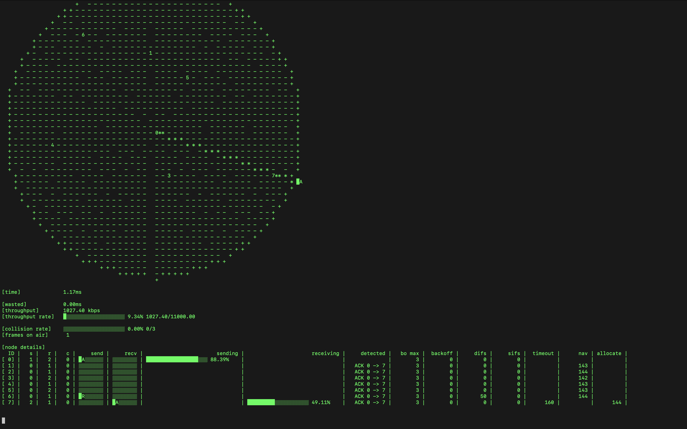

Station 3 and 6 both want to send RTS, waiting for DIFS timer.

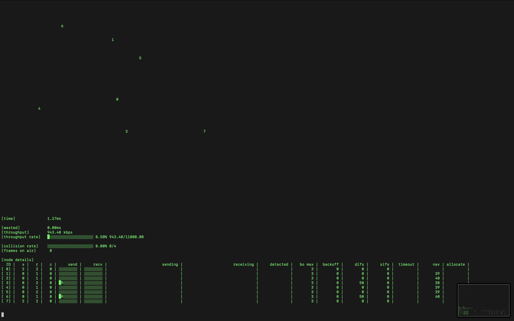

Their DIFS have ended at same time, but they chose different backoff time randomly with the backoff range.

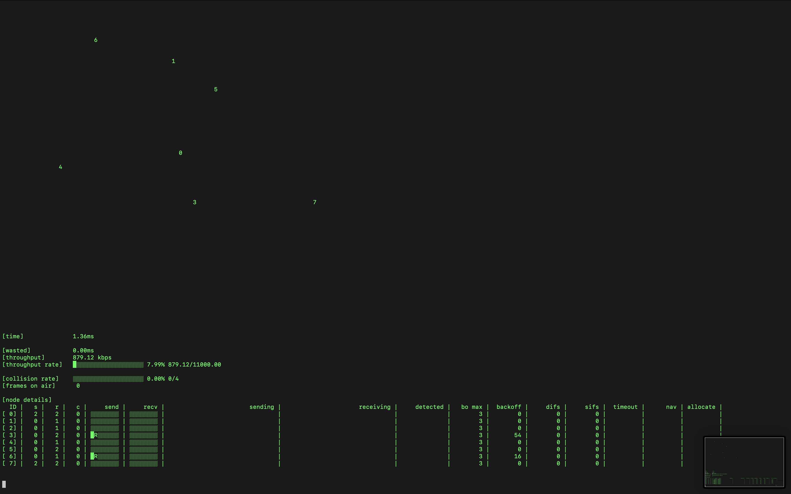

Backoff timer of Station 6 ended earlier than Station 3,
so collision did not occured.

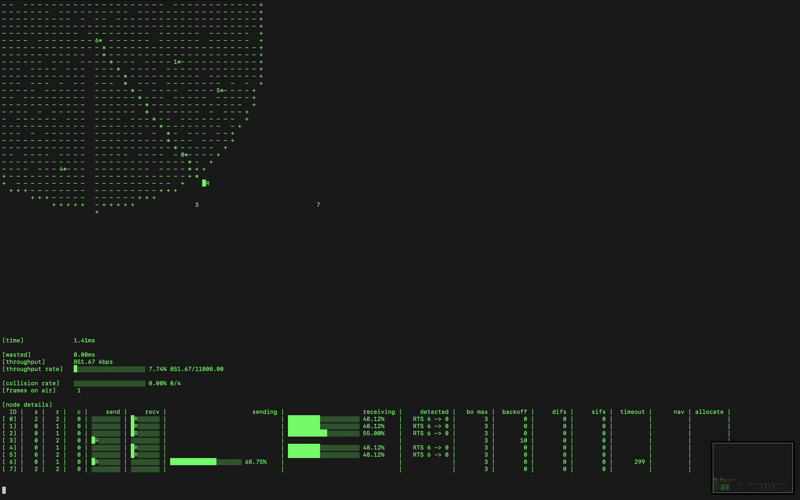

## Hidden Terminal Topology

Station 1 and 2 can not detect each other.

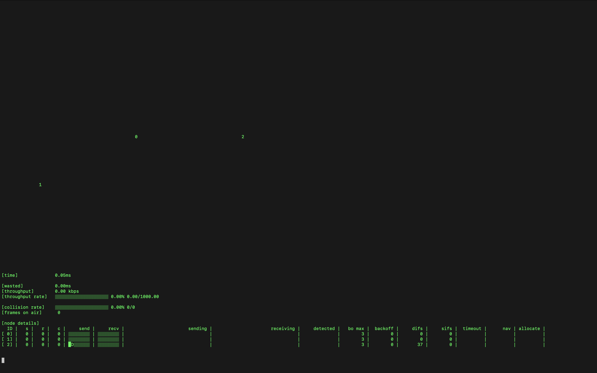

Station 2 is sending DATA to station 0

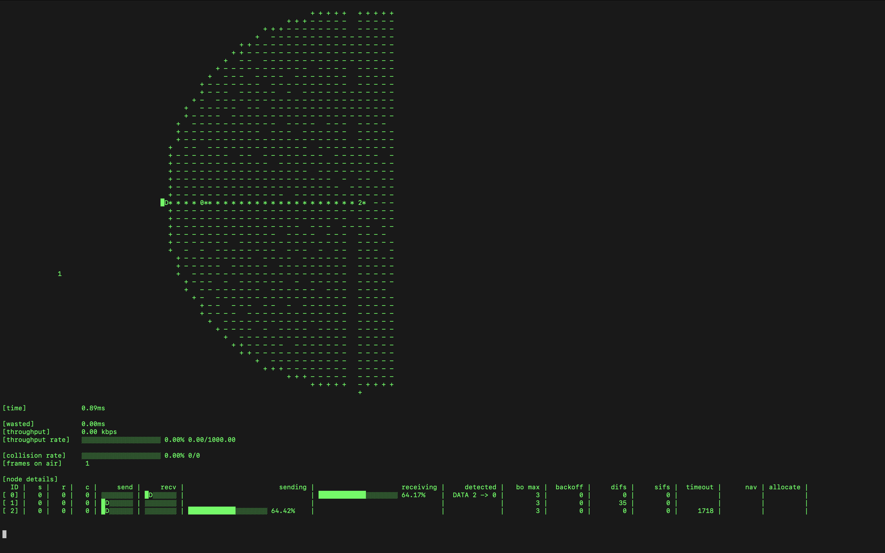

Station 1 starts to transmit, because it could not detect that the station 2 is transmitting.

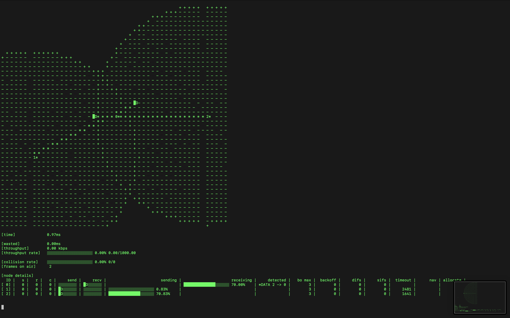

The collision occured, station 0 could not receive the both frame properly.

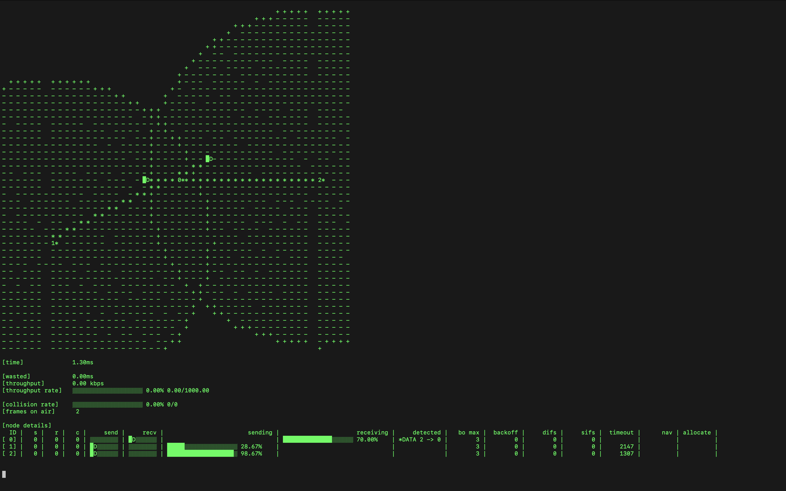

Both station 1 and 2 have ended transmission, but station 0 did not received any frame, due to the collision. Therefore ACK does not transmitted.

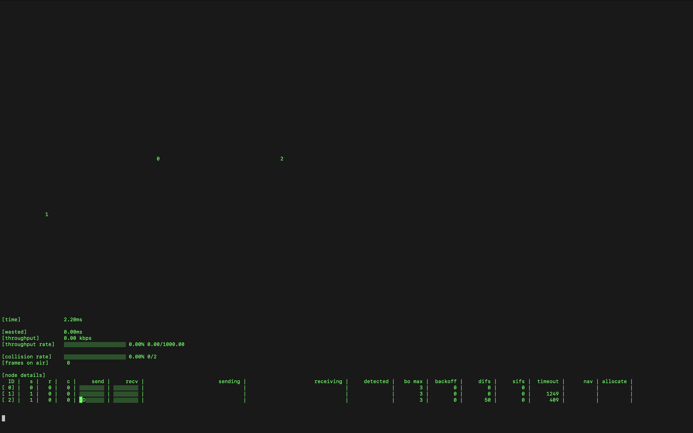

Timeout of station 2 has expired, it considers as collision occured and doubled it's backoff range.

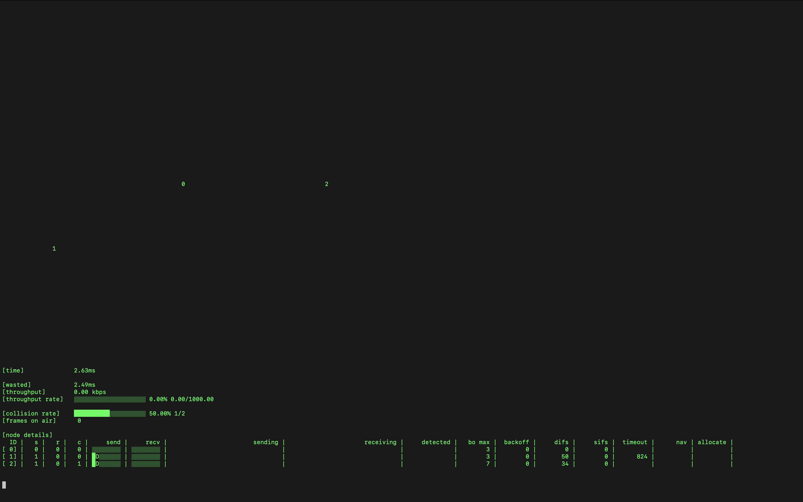

# State Diagram

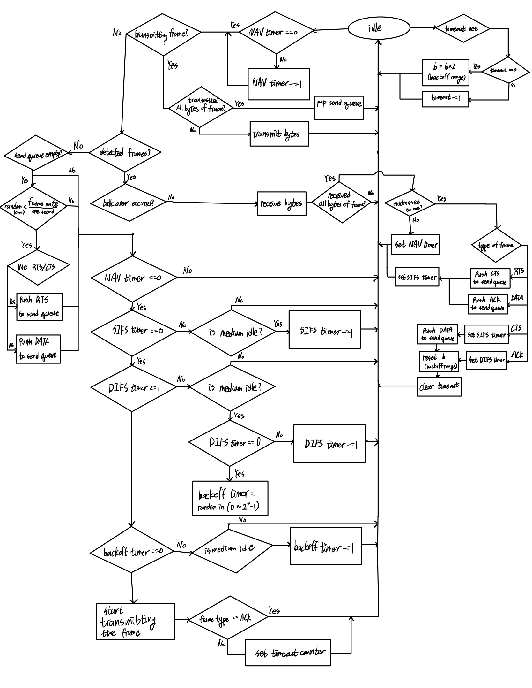

# Code

## Notice

All description for the code is written as docstring of the abstact classes.
Checkout the files at `core/abc`

## Brief description

- Abstracts
  - `core/abc/`
- Implements
  - `core/implements/`
- Timeline
  - `core/time/`
- Utils
  - `utils/`
- Configuration
  - `config.py`

### Abstracts and Implements

The classes composed of Abstract and Implement are objects that directly participate in the simulation.

1. `Station`

   A network participant that attempts to transmit frames.
   The transmission attempt probability is determined by frame_rate,
   and the transmission delay is determined by data_rate.
   It has queues for send and recv, and has a `transmitter` as an attribute that handles transmission.

   - `Transmitter`

     Handles frame transmission and reception.
     Checks channel idle status and calls designated functions according to frame types (DATA, ACK, RTS, CTS) when receiving frames. Records frame information after transmission or reception is completed to calculate metrics such as throughput and wasted time.
     The `csma` attribute it possesses is responsible for determining transmission availability (access control).

   - `CSMA`
     Manages counters such as backoff time, sifs, difs, nav, and determines transmission availability.
     CSMA/CA and BEB algorithm are implemented.

2. `Frame`

   The frame transmitted in the channel.
   Can have four types (subtypes): DATA, ACK, RTS, CTS.
   Contains sender and receiver information,
   and displays its radius when the sender is still transmitting so that stations in the channel can detect this frame.
   Only calculates its radius display and current position, and the frame object itself doesn't know whether collisions occurred or whether it arrived.

3. `Medium`

   Acts as a channel. Contains stations and frames in transmission.
   Checks frame positions and radii every tick, and if there are stations that should receive them (within radius), it notifies the stations.
   This allows stations to detect frames being transmitted in the channel.

### Timeline

Classes needed for time-based simulation are organized here.

1. `TimeLine`

   Runs in a loop, incrementing the current time by a defined step each iteration and executing the `on_tick` method of registered participants. The simulation speed can be adjusted by modifying the step and interval.
   For simulation visualization, it outputs the current state to a 2D plane at every tick.

2. `TimeParticipant`

   A participant of `TimeLine`, added to the singleton timeline during initialization.
   By overriding the `on_tick` method, you can specify what actions to take at each tick.

### Utils

Contains utility functions needed for geometry, logging, counters, etc.

### Configuration

Simulation settings can be modified in `config.py`.
Configuration can be done in dictionary format as shown below, with the following possible keys and default values:

```python
default_settings = {
    "star_topology": True,
    "with_rts": True,
    "propagation_speed": SPEED_OF_LIGHT / 3,
    "area_size": 80,
    "station_count": 10,
    "data_rate": 11 * MEGA,
    "frame_rate": 300,
    "detect_range": 40,
    "frame_size": 8 * 1500,
    "backoff_min": 4,
    "backoff_max": 1024,
    "interval": 0.05,
    "slot_time": 20,
    "step": 10,
    "max_time": ONE_SECOND,
    "log": True,
    "log_screen": True,
    "sifs": 10,
}

```

# Experiments

Over 1500 simulations were run with 180 (5 * 6 * 6) different configurations in a star topology structure with RTS/CTS enabled.

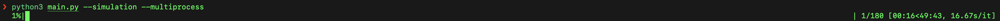

## Overview

The tables below show the average values of throughput (bps) and wasted time (in microseconds) for each metric being tested: minimum backoff time, frame rate, and station count.

```
| backoff_min |     bps     |    wasted     |
|-------------|-------------|---------------|
|           2 | 7170.120482 | 138880.240964 |
|           4 | 7237.058824 | 108934.963235 |
|           8 | 7093.939394 |  92734.659091 |
|          16 | 7080.634921 |  73405.674603 |
|          32 | 7179.842520 |  52183.188976 |
|         128 | 6951.450382 |  24692.748092 |
```

```
| frame_rate |     bps     |    wasted    |
|------------|-------------|--------------|
|      100.0 | 6869.385113 | 57256.893204 |
|      200.0 | 6970.847458 | 79673.152542 |
|      300.0 | 7373.090909 | 83020.090909 |
|      400.0 | 7106.064516 | 92513.483871 |
|      500.0 | 7252.038835 | 95935.048544 |
```

```
| station_count |     bps     |    wasted     |
|---------------|-------------|---------------|
|             3 | 5867.286822 |    659.883721 |
|             5 | 8181.818182 |  20533.181818 |
|            10 | 7943.565891 |  42918.837209 |
|            15 | 7741.440000 |  65775.520000 |
|            20 | 7269.206349 |  85926.706349 |
|            30 | 7015.081967 | 120412.336066 |
|            50 | 6695.708502 | 191461.174089 |

```

## Minimum Backoff

The bps according to Minimum Backoff is shown below:


The throughput was high for very small values like 2 and 4, then decreased, rose again at 32, and decreased again up to 128. Moderate values like 32 show high throughput, while extremely large values like 128 or small values like 8 show relatively lower throughput. This is likely because when minimum backoff time is too large, stations waste too much unnecessary time, and conversely, when it's too small, the probability of collisions increases. Then why was the bps measured high when the Minimum backoff time was extremely small, like 2 or 4?


It's presumed that when minimum backoff time is very short, bps is high because each station sends more frames during the same time period. However, since this increases the probability of collisions, throughput can be lower when the frame rate is low, even with low minimum backoff, because the number of frames to be sent itself is small. In the graph above, we can see that when backoff_min is extremely small, bps is very low when the frame rate is low.


Wasted time shows a very straightforward downward trend.

Since wasted time is directly proportional to the number of collision occurrences, when minimum backoff is small, stations are more likely to choose similar backoff times because the backoff range is small when randomly selecting backoff. Therefore, we can interpret that more collisions occur as minimum backoff becomes smaller.

Interestingly, wasted time shows an exponential decrease as minimum backoff time decreases, which is presumably because the backoff time range increases exponentially from the backoff minimum.

## Frame Rate


The bps according to frame rate also showed the highest values at moderate values like 300. When the frame rate is too low, bps is measured low because the amount of data being transmitted itself is small, and when it's too high, throughput actually decreases due to frequent collisions.


Wasted time shows a straightforward upward trend. As mentioned earlier, wasted time is proportional to the number of collision occurrences, and when the frame rate is high, stations attempt to send more frames during the same time period, leading to a higher probability of collisions.

## Station Count


The bps for station count shows an overall downward trend, presumably because with more stations, there are proportionally more frame transmission attempts during the same time period. The more transmission attempts, the higher the probability that the medium is occupied, and the average waiting time for transmission start may increase. Also, the probability of collisions during transmission increases.

On the other hand, when the station count is extremely small, bps is measured very low, which is likely because there are too few stations attempting to transmit frames, resulting in more idle channel time.


Looking at the graph above, we can see that when station count is low, bps increases proportionally with frame rate. However, as station count increases, bps actually decreases with higher frame rates.


Wasted time shows an even more clearly linear increase this time. We can see a very straightforward linear proportional relationship between station count and collision probability.

## With RTS

Additionally, we compared cases with and without RTS applied.


For bps, there was a stark performance difference with about 3 times higher bps when using RTS. We can see that by controlling access of surrounding stations through RTS/CTS, the hidden terminal problem is minimized, resulting in much higher bps.
