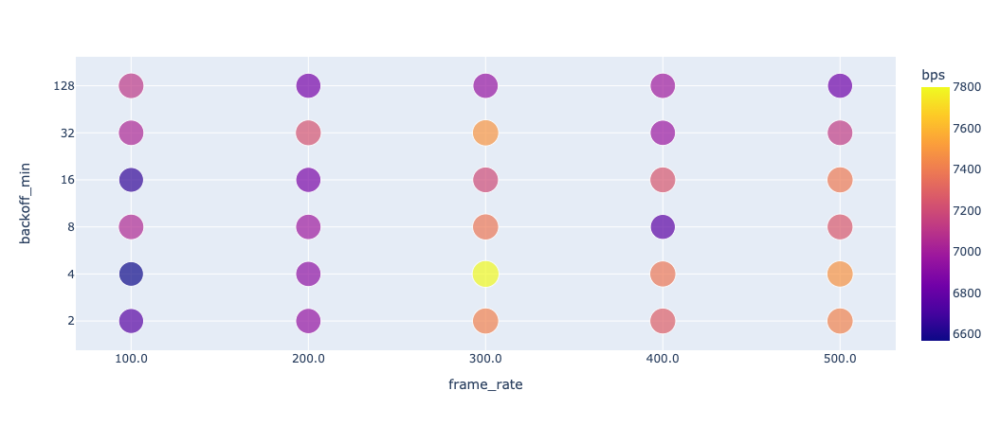

# CSMA/CA

# Usage

## Installation

```bash
$ pip install -r requirements.txt
```

## Execution

```bash
$ python3 main.py --debug # for mono simulation with graphical log
```

```bash
$ python3 main.py # for fast and many simulations with various settings
```

```bash
$ python3 main.py --multiprocess # for faster simulations with multiprocessing
```

```bash
$ python3 main.py --pass-done # pass simulations with settings which already have done
```

## Configuration

config.py

```python
default_settings = {
    "star_topology": True,
    "with_rts": True,
    "propagation_speed": SPEED_OF_LIGHT / 3,
    "area_size": 80,
    "station_count": 10,
    "data_rate": 11 * MEGA,
    "frame_rate": 300,
    "detect_range": 40,
    "frame_size": 8 * 1500,
    "backoff_min": 4,
    "backoff_max": 1024,
    "interval": 0.05,
    "slot_time": 20,
    "step": 10,
    "max_time": ONE_SECOND,
    "log": True,
    "log_screen": True,
    "sifs": 10,
}
```

## Example

10 Stations with star topology


# Code

```python
class Transmitter:

    def add_recv_record(self, frame: AbstractFrame):

        pass

    def add_sent_record(self, frame: AbstractFrame):
        pass

    # receiver methods
    def on_receive_success(self):
        pass

    def on_receive_failure(self):
        pass

    def on_timeout(self):
        pass

    def on_detect(self, frame: AbstractFrame):
        pass

    def talkover_detected(self) -> bool:
        pass

    def is_medium_busy(self) -> bool:
        pass

    def is_receiving(self) -> bool:
        pass

    def proceed_recv(self, step: int):
        pass

    # sender methods
    def push(self, frame: AbstractFrame):
        pass

    def want_to_send(self) -> bool:
        pass

    def is_sending(self) -> bool:
        pass

    def proceed_send(self, step: int):
        pass

    def send(self, step: int):
        pass

    # frame handlers
    def on_data(self, frame: AbstractFrame):
        pass

    def on_ack(self, frame: AbstractFrame):
        pass

    def on_rts(self, frame: AbstractFrame):
        pass

    def on_cts(self, frame: AbstractFrame):
        pass

    # access control
    def is_acked(self) -> bool:
        pass

    def timeout_occured(self, current: int) -> bool:
        pass

    def okay_to_send(self, step: int) -> bool:
        pass

```

# Experiments

## Overview

Star topology 구조에서 RTS/CTS가 적용된 상태로 약 1500회 이상 시뮬레이션을 실행했다.

실험 대상 지표인 minimum backoff time, frame rate, station count 별로 throughput(bps)와 wasted time(단위 micro second)의 평균 값을 나타낸 표이다.

```
| backoff_min |     bps     |    wasted     |
|-------------|-------------|---------------|
|           2 | 7170.120482 | 138880.240964 |
|           4 | 7237.058824 | 108934.963235 |
|           8 | 7093.939394 |  92734.659091 |
|          16 | 7080.634921 |  73405.674603 |
|          32 | 7179.842520 |  52183.188976 |
|         128 | 6951.450382 |  24692.748092 |
```

```
| frame_rate |     bps     |    wasted    |
|------------|-------------|--------------|
|      100.0 | 6869.385113 | 57256.893204 |
|      200.0 | 6970.847458 | 79673.152542 |
|      300.0 | 7373.090909 | 83020.090909 |
|      400.0 | 7106.064516 | 92513.483871 |
|      500.0 | 7252.038835 | 95935.048544 |
```

```
| station_count |     bps     |    wasted     |
|---------------|-------------|---------------|
|             3 | 5867.286822 |    659.883721 |
|             5 | 8181.818182 |  20533.181818 |
|            10 | 7943.565891 |  42918.837209 |
|            15 | 7741.440000 |  65775.520000 |
|            20 | 7269.206349 |  85926.706349 |
|            30 | 7015.081967 | 120412.336066 |
|            50 | 6695.708502 | 191461.174089 |

```

## Minimum Backoff

Minimum Backoff 에 따른 bps는 아래와 같다.


2, 4와 같이 매우 작은 값일 때 높았다가, 감소하다가 32일 때 다시 상승했다가 128까지 다시 감소하는 양상을 띄었다. 32처럼 너무 작지도 크지도 않은 값에서 큰 throughput을 보이고 128처럼 너무 큰 값이나 8처럼 작은 값에서는 상대적으로 throughput이 낮아진다. Minimum backoff time이 너무 큰 경우에는 station들이 불필요한 시간을 지나치게 많이 낭비하고, 반대로 작은 경우에는 collision 발생 확률이 늘어날 수 있기 때문에 이러한 결과가 나오는 것으로 추측된다. 그렇다면 2, 4 처럼 Minimum backoff time 이 지나치게 작은 경우에는 왜 bps가 높게 측정되었을까?



minimum backoff time이 매우 짧은 경우 같은 시간 동안 각 station이 보내는 frame의 수가 많을 것이기 때문에 bps가 높게 나온 것으로 추측된다. 그러나 이 경우 collision 확률이 높아지므로 frame rate가 낮아서 minimum backoff 가 낮더라도 보내고자하는 frame 수 자체가 작은 경우에는 throughput이 낮아질 수 있다. 위 그래프에서 backoff_min이 지나치게 작은 경우 frame_rate가 낮을 때 bps가 매우 낮은 편임을 확인할 수 있다.


Wasted time은 매우 정직한 우 하향의 그래프가 나타난다.

Wasted time은 collision의 발생 횟수와 정비례하기 때문에, minimum backoff가 작을 경우 각 station이 random하게 backoff를 선택할 때 backoff range가 작아서 비슷한 backoff time을 선택하게 될 확률이 상대적으로 높다. 따라서 minimum backoff가 작을 수록 collision이 많이 일어난다고 해석할 수 있다.

흥미로운 점은 minmum backoff time의 감소에 따라 wasted time이 exponential하게 감소하는 양상을 보이는데, 이는 backoff time range가 backoff minmum으로부터 exponential 하게 증가하기 때문인 것으로 추측된다.

## Frame Rate


Frame rate에 따른 bps도 300처럼 너무 작지도 크지도 않은 값에서 가장 높은 bps를 보였다. Frame rate가 너무 작을 경우 전송되는 데이터의 양 자체가 적다보니 bps가 낮게 측정되고, 너무 큰 경우에는 잦은 collision 발생으로 오히려 throughput이 낮아지는 것으로 추측해 볼 수 있다.


Wasted time은 정직한 우 상향 그래프가 나타난다. 앞서 서술했듯 wasted time은 collision 발생 횟수와 비례하는데, frame rate가 높은 경우 각 station들이 같은 시간동안 더 많은 frame을 보내려고 시도하기 때문에 collision 발생 확률이 더 높다.

## Station Count


Station count에 대한 bps는 전반적으로 우 하향의 양상을 띄는데, station이 많을 경우 같은 시간동안 frame 전송 시도가 그에 비례하게 더 많이 일어나기 때문인 것으로 추측된다. 전송 시도가 많을 수록 medium이 점유중일 확률이 크고, 전송 시작을 위해 평균적으로 대기해야 하는 시간이 늘어날 수 있다. 또 전송 중 collision이 발생할 확률도 높아진다.

한편 station count가 지나치게 작은 경우 bps가 매우 낮게 잡히는데, 이는 frame 전송을 시도할 station이 너무 적어서 채널이 유휴한 시간이 많기 때문으로 추정된다.


위 그래프를 보면, station count가 낮은 경우 frame rate와 비례하게 bps가 증가하는 것을 볼 수 있다. 그러나 station count가 증가함에 따라, frame rate가 높을 수록 오히려 bps가 낮아지는 것을 확인할 수 있다.


Wasted time은 이번에도 더 명확하게 linear한 증가 양상을 보여준다. Station count와 collision 발생 확률이 매우 정직한 linear한 비례관계에 있음을 확인할 수 있다.

## With RTS

추가적으로, RTS를 적용하지 않은 경우와도 비교해보았다.


bps의 경우 RTS를 사용했을 때 약 3배의 bps가 측정되어 성능차이가 극명했다. RTS, CTS 를 통해 주변 station의 access 를 제어함으로써 hidden terminal problem을 최소화하여 훨씬 큰 bps를 보여주고 있음을 확인할 수 있다.
